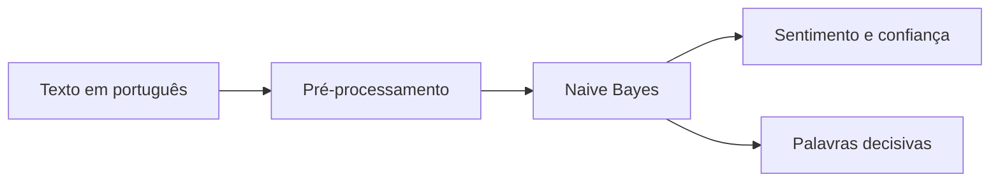

# Classificador de Sentimentos em Python

[](https://github.com/Caue-Macrini/classificador-sentimentos-ia/actions)

Implementação de um classificador Multinomial Naive Bayes do zero, usando apenas a biblioteca padrão do Python. O projeto classifica avaliações em português, trata negações e explica quais termos mais influenciaram cada resultado.

## Destaques técnicos

- Pré-processamento, remoção de acentos e *stopwords*.
- Tratamento de negação com tokens como `NAO_gostei`.
- Suavização de Laplace e log-probabilidades para estabilidade numérica.
- Confiança por *softmax* e explicabilidade por contribuição de palavras.
- Testes automatizados, Docker e integração contínua.



## Executar

```bash
git clone https://github.com/Caue-Macrini/classificador-sentimentos-ia.git
cd classificador-sentimentos-ia
python classificador_sentimentos.py
```

Para validar o projeto:

```bash
pip install -r requirements-dev.txt
pytest -q
docker build -t classificador-sentimentos .
docker run -it --rm classificador-sentimentos
```

## Limitações e próximos passos

A base é pequena e não cobre sarcasmo ou contexto complexo. Evoluções naturais incluem ampliar o conjunto de dados, comparar métricas com modelos de referência e expor a inferência por API.

## Licença

MIT.
